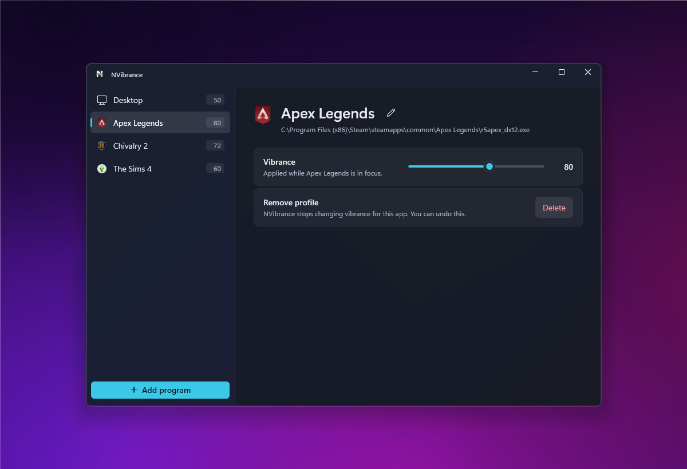
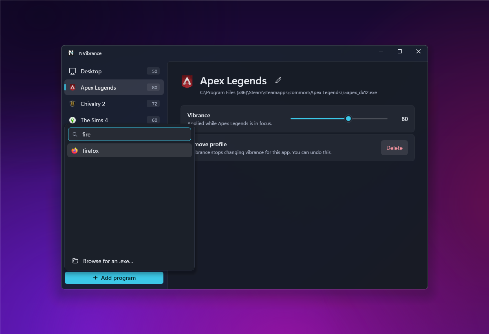
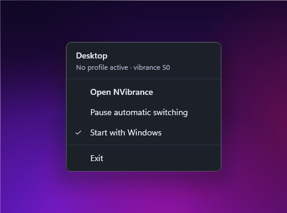

#   NVibrance

NVibrance is a small Windows app (WPF) that applies per-application NVIDIA digital vibrance profiles. It runs in the tray, watches which application is in the foreground, and applies that application's saved vibrance, restoring your desktop value when you switch away.



## Features
- **Per-application profiles.** Each game keeps its own vibrance, applied whenever it gains focus.
- **Desktop row.** The value used when no profile matches sits at the top of the sidebar and is edited like any profile.
- **Quick adding.** Pick from the apps that are running, with search, or browse for an `.exe`.
- **Forgiving edits.** Rename a profile in place (click its name or press F2). Deleting can be undone for a few seconds (Undo or Ctrl+Z).
- **Tray status.** The tray icon's tooltip and menu show what is applied right now.
- **Pause.** Turn automatic switching off from the tray menu, for example while recording, and back on again.
- **Fits Windows 11.** Mica backdrop, dark title bar, keyboard focus rings, and support for high contrast themes and the "Animation effects" setting.
- **Autostart** with Windows, from the tray menu.
- **Single-file publish**, framework-dependent or self-contained.

## Usage
1. Launch NVibrance, or let it start with Windows.
2. Click **Add program** and pick a running game, or choose **Browse for an .exe…**.
3. Set the game's vibrance with the slider. It is saved automatically and applied whenever that game is in focus.
4. Select **Desktop** to change the vibrance used everywhere else. That change applies immediately.



Closing the window keeps NVibrance running in the tray; the first time, Windows shows a notification saying so. Left-click the tray icon to open the window, or right-click it for the menu:



- The first line shows what is applied now, for example `Apex Legends · Profile active · vibrance 80`.
- **Pause automatic switching** restores your desktop vibrance and stops switching until you turn it off again. The window shows a **Resume** button while paused. Pausing does not survive a restart.

### Keyboard shortcuts
| Key | Action |
| --- | --- |
| F2 | Rename the selected profile |
| Del | Delete the selected profile (in the sidebar) |
| Ctrl+Z | Undo the last delete, while its notice is showing |
| Enter / Esc | Confirm or cancel a rename; add or close in the picker |

### Command-line switches
| Switch | Effect |
| --- | --- |
| `--minimized` | Starts hidden in the tray (used by the autostart entry). |
| `--verbose` | Writes detailed detection diagnostics to the log file. Off by default. |

## Requirements
- Windows (desktop)
- .NET 10 runtime for framework-dependent builds, or none for self-contained builds
- NVIDIA drivers and NvAPI available (uses `NvAPIWrapper.Net`)

## Quick start (development)
1. Clone the repo.
2. Restore and build:
   - `dotnet restore NVibrance.slnx`
   - `dotnet build NVibrance.slnx -c Release --no-restore`
3. Run from IDE (Rider) or run `dotnet run --project NVibrance/NVibrance.csproj` for debugging.

## Where NVibrance stores things

| What | Location |
| --- | --- |
| Profiles | `%APPDATA%\NVibrance\profiles.json` |
| Corrupt-profile backup | `%APPDATA%\NVibrance\profiles.json.bad` |
| "Still running" notice shown | `%APPDATA%\NVibrance\tray-hint-shown` (empty marker file) |
| Log file | `%LOCALAPPDATA%\NVibrance\logs\nvibrance.log` |
| Previous log (rotated) | `%LOCALAPPDATA%\NVibrance\logs\nvibrance.1.log` |
| Autostart entry | `HKCU\Software\Microsoft\Windows\CurrentVersion\Run`, value `NVibrance` |

Notes:
- Profiles are written a moment after you make a change, and again on exit. Writes are atomic, so an interrupted save cannot leave a half-written file.
- If `profiles.json` is ever unreadable, it is copied to `profiles.json.bad` and startup continues with an empty list, so the damaged file is still recoverable by hand.
- The two folders differ on purpose. `%APPDATA%` (Roaming) holds settings that should follow you to another machine, so profiles live there. `%LOCALAPPDATA%` holds machine-specific data, so logs live there — they reference local paths, process ids and hardware, and where roaming profiles or folder redirection are configured, anything under Roaming is copied at logon.
- The log rotates at 1 MB and keeps one previous file, so it cannot grow without bound.
- Icons are loaded from executable files and cached in memory only; nothing is written to disk.
- Uninstalling is just deleting the executable — remove the two folders above and the registry value to clear everything.

## Troubleshooting

**Start with the log.** `%LOCALAPPDATA%\NVibrance\logs\nvibrance.log` records every profile applied and restored. To watch it live while you reproduce a problem:

```powershell
Get-Content "$env:LOCALAPPDATA\NVibrance\logs\nvibrance.log" -Wait -Tail 20
```

**If a game is not being detected**, restart with `--verbose` and reproduce. Every foreground change then logs the window handle, process id, resolved executable path, and whether a profile matched:

```
NVibrance.exe --verbose
...
[DEBUG] Foreground hwnd=0x50A32 pid=18244 path=C:\Games\Apex\r5apex_dx12.exe -> profile 'Apex'
```

That line tells you which of three things went wrong: `path=<unresolved>` means the executable path could not be read (the profile can still match by process name); a path that does not match your profile means the game launched from a different location than the one you added; and `no matching profile` with the correct path means the profile exists for a different executable — many games ship separate DirectX 11 and 12 binaries, so a profile for `r5apex.exe` will not match `r5apex_dx12.exe`.

Other notes:
- If vibrance changes do not apply at all, verify NVIDIA drivers and that NvAPI is available. Errors from the driver are logged.
- If icon loading fails on some executables, it falls back gracefully.
- Autostart writes to the current user registry key `Software\Microsoft\Windows\CurrentVersion\Run`.

## Acknowledgements
- Inspired by [VibranceGUI](https://github.com/juv/vibranceGUI) — thanks to the original project for the idea and UX inspiration.

## Development status
This is a hobby project, developed in spare time, so expect some rough edges. Issues and suggestions are welcome.

